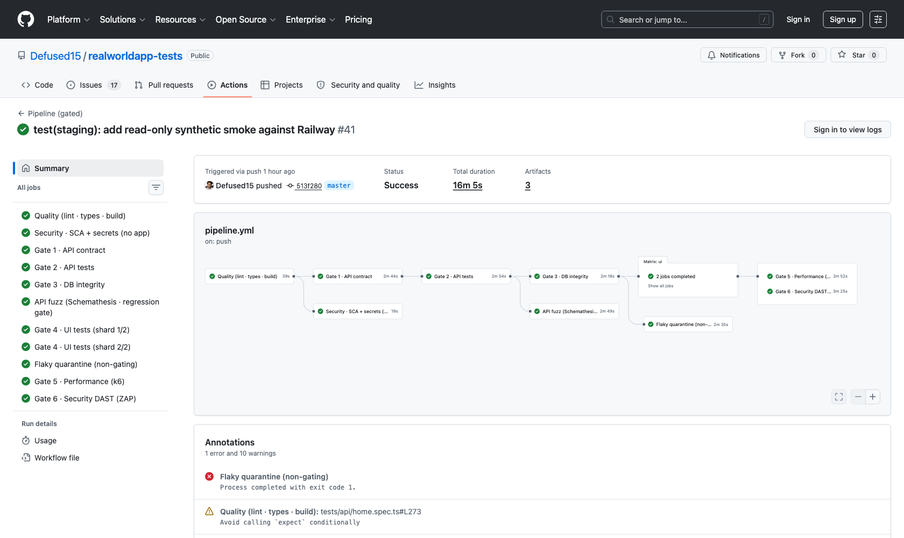
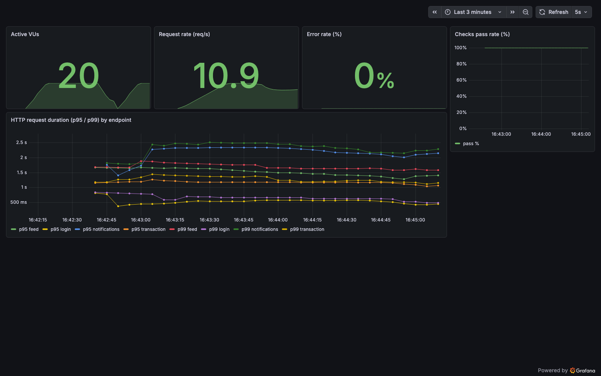
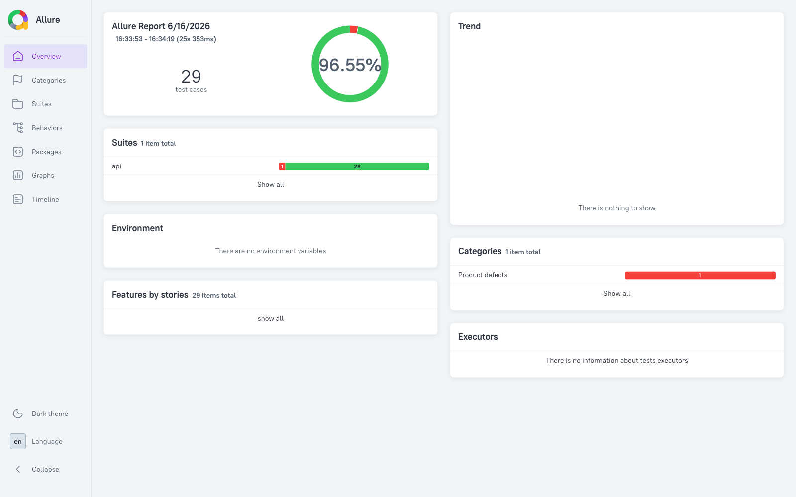

# realworldapp-tests

[](https://github.com/Defused15/realworldapp-tests/actions/workflows/pipeline.yml)
[](https://github.com/Defused15/realworldapp-tests/actions/workflows/nightly.yml)
[](https://github.com/Defused15/realworldapp-tests/actions/workflows/staging-smoke.yml)


**A black-box, production-grade test suite for the [Cypress Real World App](https://github.com/cypress-io/cypress-realworld-app)** — a payment/transactions app. ~400 automated checks across **nine layers** (UI, API, DB-integrity, unit, mutation, performance, property/fuzz, chaos, security) wired into a **fail-fast gated CI pipeline**, with live Grafana dashboards, executive QA reporting, and a self-updating GitHub-issue bug tracker.

> **Black-box by rule:** these tests never read the application's source code. Everything is exercised from the outside — HTTP, the browser, SQL, and DAST — exactly as a real client or attacker would. See [ADR-0002](docs/adr/0002-black-box-only.md).

### Highlights

- **9 test layers, one gated pipeline** — `contract → api → db → ui → performance → zap → report`, fail-fast cheap→expensive ([ADR-0003](docs/adr/0003-sequential-ci-gates.md)).
- **SQL data-integrity layer** — breaks the API round-trip circularity by reading actual Postgres rows ([ADR-0004](docs/adr/0004-sql-data-integrity-layer.md)).
- **Mutation testing (Stryker)** — proves the tests actually catch regressions, not just pass.
- **Property/fuzz testing (Schemathesis) as a regression gate** — auto-generates thousands of requests from the OpenAPI spec; known app 500s are excluded by `operationId` so it stays green on existing debt and red on a _new_ crash. It found `BUG-API-FUZZ-009` on its own.
- **Chaos engineering** — black-box DB-outage and DB-latency experiments (Pumba) assert fail-fast + auto-recovery; surfaced an N+1 latency-amplification (~30×).
- **Live performance observability** — k6 → Prometheus → Grafana, with k6 `thresholds` acting as the CI perf gate.
- **Synthetic monitoring** — read-only `@staging` smoke against a live Railway deployment every 6 hours.
- **Self-documenting defects** — `docs/bug-reports/bugs.yml` is the single source of truth; a workflow renders each entry into one GitHub issue and closes it when fixed.
- **Executive QA reporting** — `/qa-report` generates a client-facing status report (coverage, KPIs, risk, ROI) from live metrics → [`docs/qa-reports/`](docs/qa-reports/).

### In action

**Sequential CI gates running on GitHub Actions** — `quality → contract → api → db → fuzz → ui (×2 shards) → performance → ZAP`, all green:



**Live k6 performance dashboard** (Grafana ← Prometheus ← k6) — VUs, request rate, error rate, checks, and p95/p99 latency by endpoint under a 20-VU load:



**Allure test report** — pass rate, suites, and defect categories with per-test drill-down:



## Stack

| Layer              | Tool                           | Purpose                                              |
| ------------------ | ------------------------------ | ---------------------------------------------------- |
| E2E / UI           | Playwright                     | Browser automation, visual regression, accessibility |
| API                | Playwright                     | HTTP contract, security, performance                 |
| DB Integration     | Vitest + pg                    | SQL cross-checks: API writes vs actual DB rows       |
| Unit               | Vitest                         | Pure factories — fast, mutation-tested               |
| Mutation           | Stryker                        | Proves the unit tests actually catch regressions     |
| Property / fuzz    | Schemathesis                   | OpenAPI-driven fuzzing; regression gate in CI        |
| Performance        | k6                             | Load/stress/spike; SLOs as CI gate                   |
| Observability      | Prometheus + Grafana           | Live k6 metrics dashboards                           |
| Chaos / resilience | Pumba + Docker                 | Black-box DB-outage / DB-latency fault injection     |
| Security           | OWASP ZAP · Trivy · Gitleaks   | Black-box DAST + SCA + secret scanning               |
| Accessibility      | axe-core/playwright            | WCAG 2.1 AA                                          |
| Reporting          | Allure                         | Rich, historical test reports                        |
| Release            | semantic-release               | Auto version + CHANGELOG from Conventional Commits   |
| Test data          | @faker-js/faker                | Realistic, unique values per test                    |
| Linting            | GTS + eslint-plugin-playwright | Google TypeScript Style, Playwright-specific rules   |

> Full organizing principle, layers, tags and gates: **[docs/test-strategy.md](docs/test-strategy.md)**.
> Decisions behind the architecture: **[docs/adr/](docs/adr/)**.

## Test Pyramid

```
            ▲
           /|\
          / | \        E2E / UI Tests (Playwright)
         /  |  \       tests/ui/*.spec.ts
        /   |   \      Happy path, edge, security, a11y, visual
       /----|----\
      /     |     \    API Tests (Playwright)
     /      |      \   tests/api/*.spec.ts
    /       |       \  Functional, contract, security, performance
   /--------|--------\
  /         |         \ DB Integration Tests (Vitest + pg)
 /          |          \ tests/db-integration/*.test.ts
/           |           \ API write → SQL read, orphan checks, schema constraints
```

**Why three layers?**

- **UI tests** catch rendering bugs, navigation flows, and accessibility issues.
- **API tests** catch contract regressions and auth/security holes.
- **DB integration tests** break the API-round-trip circularity — if both the write and read endpoints share the same bug, an API test misses it. A SQL cross-check doesn't.

## Prerequisites

The app runs in Docker with PostgreSQL. Before running any tests:

```bash
docker compose up -d      # start app + DB
npm run db:seed           # reset DB to known seed state
```

The app exposes:

- `http://localhost:3000` — UI
- `http://localhost:3001` — API

Primary seed user: **Heath93 / s3cret** (Ted Parisian, id: `uBmeaz5pX`)

## Project Structure

```
tests/
  ui/
    signin.spec.ts          ← all UI tests for signin
    signup.spec.ts          ← all UI tests for signup
    home.spec.ts            ← all UI tests for home feed
    transaction.spec.ts     ← all UI tests for transaction detail
  api/
    signin.spec.ts          ← all API tests for signin/auth
    signup.spec.ts          ← all API tests for signup/users
    home.spec.ts            ← all API tests for feeds + notifications
    transaction.spec.ts     ← all API tests for transactions, likes, comments
  db-integration/           ← Vitest + pg (NOT Playwright)
    signup.test.ts          ← user writes, bcrypt, unique constraint
    signin.test.ts          ← API response vs DB row, modifiedAt unchanged
    home.test.ts            ← feed IDs exist in DB, isRead consistency
    transaction.test.ts     ← write-then-SQL, orphan checks, schema validation
    helpers.ts              ← loginAs(), createFreshUser() — fetch-based, no Playwright
  pages/
    base.page.ts            ← abstract base with shared nav locators
    signin.page.ts
    signup.page.ts
    home.page.ts
    transaction.page.ts
  fixtures/
    fixtures.ts             ← test.extend() with page fixtures + auth state
    index.ts                ← re-exports test and expect
  helpers/
    api-helpers.ts          ← Playwright-context helpers: loginAs(), createUser()
    db-helpers.ts           ← pg Pool: queryOne(), queryMany(), queryCount(), queryScalar()
  utils/
    factories.ts            ← pure functions, no side effects: buildUser()
  data/
    xss-payloads.json       ← attack strings for security tests
    seed-users.json         ← known users after db:seed
  staging/
    smoke.spec.ts           ← read-only @staging synthetic monitor (Railway)
  scripts/
    seed.ts                 ← POST /testData/seed — reset DB to baseline
    teardown.ts             ← POST /testData/seed — same as seed
    schemathesis.sh         ← property/fuzz gate (excludes known app 500s by operationId)
    flaky-summary.ts        ← parses the Playwright JSON report → CI flaky summary
  global-setup.ts           ← UI login once before all Playwright UI tests

perf/k6/                    ← k6 scenarios (one per feature) + lib (config/thresholds/profiles)
observability/              ← Prometheus + Grafana stack for k6 metrics
security/                   ← ZAP rules, Trivy config (DAST/SCA — black-box)
chaos/                      ← black-box resilience experiments (Pumba + docker stop)

docs/
  test-strategy.md          ← master doc: layers, pyramid, tags, gates, tooling
  adr/                      ← Architecture Decision Records (the "why")
  api/openapi.yaml          ← hand-authored OpenAPI spec (drives Schemathesis)
  test-cases/               ← Gherkin .feature files (human-readable scenarios)
  bug-reports/bugs.yml      ← app-bug manifest (single source of truth → GitHub issues)
  qa-reports/               ← executive QA status reports (/qa-report)
  security-reports/         ← triaged DAST/SCA findings
  workflows/                ← app workflow maps (generated by exploratory-agent)

.github/workflows/
  pipeline.yml              ← sequential CI gates (contract→api→db→ui→perf→zap→report)
  nightly.yml               ← heavy: @visual/@a11y, cross-browser, perf stress/spike, chaos
  staging-smoke.yml         ← read-only synthetic smoke vs Railway (cron 6h + manual)
  bug-report-sync.yml       ← renders bugs.yml → one GitHub issue per bug
  release.yml               ← semantic-release after a green pipeline
```

## Running Tests

### DB Integration (Vitest — fastest, no browser)

```bash
npm run db:seed        # always seed before running
npm run test:db        # run all db-integration tests once
npm run test:db:watch  # watch mode during development
```

### API Tests (Playwright — no browser)

```bash
npm run test:api

# by tag
npm run test:smoke
npm run test:contract
npm run test:security
npm run test:performance
```

### UI Tests (Playwright — headed browser)

```bash
npm run test:ui

# by tag
npm run test:smoke
npm run test:a11y
npm run test:visual
npm run test:regression
```

### Full suite

```bash
npm run test:all   # db-integration → Playwright (all layers)
npm test           # Playwright only (UI + API)
```

### Visual snapshots

Visual baseline snapshots live in `__snapshots__/` and are committed to git.

```bash
# Create baselines (first run always passes)
npx playwright test --update-snapshots --grep @visual

# Commit the baselines
git add __snapshots__/
git commit -m "chore: update visual snapshots"
```

## CI Strategy — sequential gates

`.github/workflows/pipeline.yml` runs gates fail-fast, cheap → expensive. A
broken gate stops the ones after it.

```
quality ──┬─ security-sca (SCA + secrets — no app needed)
          └─ setup-app → contract → api → db → ui (sharded ×2) → performance → zap → report
```

| Trigger      | What runs                                                                   |
| ------------ | --------------------------------------------------------------------------- |
| Pull Request | quality, security-sca, then gates 1–4 at reduced scope (`@smoke`)           |
| Push to main | quality, security-sca, all gates full scope; `release` on green             |
| Nightly      | full suite incl. `@visual`/`@a11y`, cross-browser, perf stress/spike, chaos |
| Every 6 h    | read-only `@staging` synthetic smoke vs the live Railway deployment         |

The app is booted in CI via a **producer/consumer GHCR pattern**: the app repo
publishes an opaque `ghcr.io/defused15/rwa-app` image (black-box — CI never sees
the source), and `setup-app` boots it with a throwaway Postgres for the run.
App-dependent gates are guarded by `vars.APP_IMAGE`; the UI gate runs as two
shards in parallel. See
[docs/adr/0003-sequential-ci-gates.md](docs/adr/0003-sequential-ci-gates.md).

## Architecture Decisions

> Formal records live in **[docs/adr/](docs/adr/)**. The notes below are the
> quick rationale.

### Why Vitest for DB integration, not Playwright?

Playwright's `request` fixture carries session state and runs inside a browser context — that's appropriate for testing the API as a user would call it. But DB integration tests need direct database access (`pg.Pool`) and no browser overhead. Vitest runs as a pure Node.js process, connects directly to PostgreSQL, and executes 40+ SQL assertions in under 5 seconds.

### Why pg instead of docker exec psql?

`docker exec psql` is a shell subprocess: slow, container-name-fragile, no parameterized queries (SQL injection risk in test code), and returns raw text that must be parsed back from JSON. `pg.Pool` connects natively — typed rows, `$1/$2` placeholders, real error objects, and 10× faster.

### Why parameterized queries?

Even in test code, string interpolation in SQL is a bad habit. Parameterized queries (`WHERE id = $1`) protect against accidental injection when test data contains special characters (e.g., the XSS payload `'; DROP TABLE users--`).

### One file per feature per layer

```
tests/ui/signin.spec.ts          ← Playwright UI
tests/api/signin.spec.ts         ← Playwright API
tests/db-integration/signin.test.ts  ← Vitest + pg
```

Each file owns assertions for its feature only. Cross-feature navigation stops at a URL assertion + the destination page's POM ready anchor — content assertions belong in the destination spec.

### Page Object Model

All locators live in `tests/pages/*.page.ts`. Test files never contain raw CSS or attribute selectors. When a test needs a locator from another page's POM (e.g., to assert a link navigates correctly), it imports the destination POM class and instantiates it directly:

```typescript
import {SignupPage} from '../pages/signup.page';
await expect(new SignupPage(page).submitButton).toBeVisible();
```

## Adding Tests for a New Feature

Use the `/gen-test` skill — it scans the live page and orchestrates 5 agents in 3 waves:

```
Wave A (parallel): pom-agent + support-agent + gherkin-agent
        ↓
Wave B (parallel): ui-test-agent + api-test-agent
        ↓
Wave C:            data-integrity-agent  → tests/db-integration/<feature>.test.ts
```

```bash
# Example
/gen-test bank-accounts on http://localhost:3000/bankaccounts
```

To add DB integration tests for an existing feature:

```bash
/data-integrity bank-accounts
```

## Environment Variables

Defined in `.env` (not committed):

```
BASE_URL=http://localhost:3000
API_URL=http://localhost:3001
TEST_USER_USERNAME=Heath93
TEST_USER_PASSWORD=s3cret
```

DB connection for the SQL layer (`tests/helpers/db-helpers.ts`) defaults to
`localhost:5433/rwa_dev` (user: `postgres`, password: `postgres`) and is
overridable via `DB_HOST` / `DB_PORT` / `DB_NAME` / `DB_USER` / `DB_PASSWORD`.
Staging targets live in `.env.staging` (Railway, read-only). A `.env.example`
documents the required keys.

## Known App Bugs

The manifest `docs/bug-reports/bugs.yml` is the **single source of truth**. The
`bug-report-sync` workflow renders each entry into one self-contained GitHub
issue and **closes it automatically** when its status flips to `resolved`. A test
never asserts broken behavior to stay green: known, unfixed bugs are
`test.skip`-ped with a `BUG-…` reference; everything else asserts the correct
behavior. The manifest and the GitHub issues are authoritative.

As of **2026-06-16**: **24 tracked defects — 17 open, 7 re-verified fixed.**
Highest-priority open defects (full list + repro in the manifest):

| ID                 | Surface               | Severity | Issue                                                         |
| ------------------ | --------------------- | -------- | ------------------------------------------------------------- |
| BUG-TXN-SEC-001    | GET /transactions/:id | Critical | **IDOR** — a user can read another user's private transaction |
| BUG-API-FUZZ-008   | 500 responses         | High     | Error bodies leak filesystem path, Prisma internals & source  |
| BUG-API-FUZZ-001   | POST /users           | High     | Wrong-typed fields → 500 (no input validation)                |
| BUG-API-FUZZ-009   | PATCH /users/:id      | High     | Wrong-typed fields → 500 (found by the Schemathesis gate)     |
| BUG-008            | POST /login           | Medium   | `remember=true` sends `Expires`, not `Max-Age`                |
| BUG-TXN-SCHEMA-001 | transactions.amount   | Medium   | Stored as `double precision`, should be `integer` (cents)     |

**Re-verified FIXED 2026-06-16:** BUG-001, BUG-002 (now 422/409 JSON),
BUG-003/BUG-004 (no more bcrypt-hash leak), BUG-HOME-001 (date filter → 200),
BUG-TXN-API-001 (unknown ID → 404), BUG-API-FUZZ-006 (taken username → 422).

> Full coverage, KPIs, risk and ROI: the latest executive report in
> **[docs/qa-reports/](docs/qa-reports/)**.
